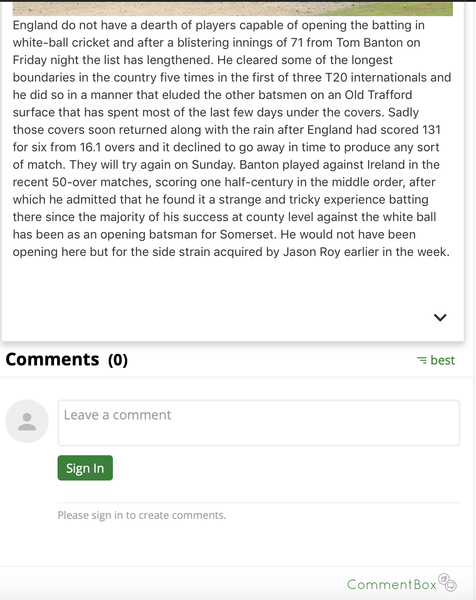

# News Search App - Responsive Web Design

(CSCI571-Web Technologies Project)  
Implemented a news app based on web and mobile device that demonstrated news of different categories and created a personalized bookmark for users to save articles and to share on their own social media. This implementation is based on responsive web design, so the pages look good for devices of different screen sizes. It also stores user data in HTML5 LocalStorage, so that after an user close and then re-open the page, the news articles stored in bookmark section will still be there  

**Skills:** 
**- Client Side: React, React-Bootstrap, HTML5, HTML, CSS** 
**- Server Side: JavaScript, Node.js** 
**- Other Skills Used: AJAX, JSON, Google Cloud App Engine, Responsive Web Design (RWD), HTML5 LocalStorage, Guardian News API, New York Times API, Comment-Box API, Bing Autosuggest API**  
### Demo Video

 
### Features
##### Main Page
Main page includes a navigation bar with six news category sections: Home, World, Politics, Business, Technology, and Sports. A search bar, bookmark button, switch of news source, and a table of top news cells sorted from most recent published date

	

 
There is a category tag in buttom-right of each news cell  

	

 
Users can also switch the news source from either Guardian News or New York Times in the top-right   

	
	

 
Clicking the link icon of each news title allows users to share news on their own social media   

	
	

##### Responsive Web Design
- Layout changes automatically when users change the screen size

	
	

##### Detailed Article
- Users can click on any news cell to read the detailed article. Clicking the bookmark icon in the top-right to add/remove this news to/from your own bookmark
- Comment box below each article for users to share their opnions
- Clicking on the arrow in the buttom-right corner to read the full content of article

	
	
	

##### Bookmark Section
- Showing the news articles that users added to bookmark section

	

