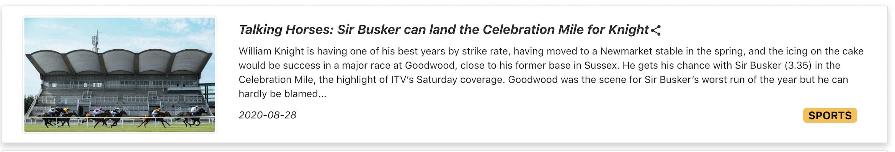

# News Search App - Responsive Web Design

(CSCI571-Web Technologies Project)  
Implemented a news app based on web and mobile device that demonstrated news of different categories and created a personalized bookmark for users to save articles and to share on their own social media. This implementation is based on responsive web design, so the pages look good for devices of different screen sizes  

**Skills:** 
**- Client Side: React, React-Bootstrap, HTML5, HTML, CSS** 
**- Server Side: JavaScript, Node.js** 
**- Other Skills Used: AJAX, JSON, Google Cloud App Engine, Responsive Web Design (RWD) Guardian News API, New York Times API, Comment-Box API, Bing Autosuggest API**  

### Features
##### Main Page
- Main page includes a search bar, a navigation bar, bookmark button, switch of news source, and a table of top news cells sorted from most recent published date

	

- Navigation bar of six news categories: Home, World, Politics, Business, Technology, and Sports, there is a category tag in button-right of each news cell 

	

- Users can also switch the news source from either Guardian News or New York Times in the top-right  

	
	

- Clicking the link icon of each news title allows users to share news on their own social media  

	
	

